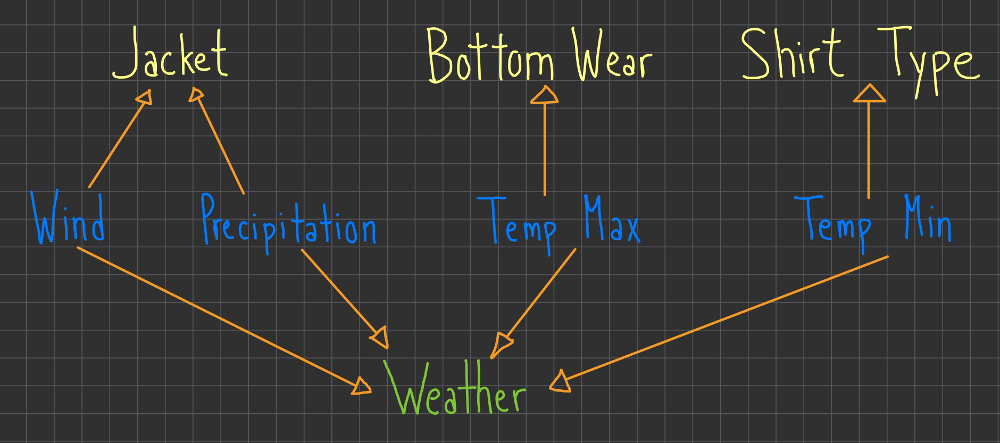

# WeatherWear: AI-Powered Outfit Recommendations Based on Weather Predictions

## PEAS / Agent Analysis

We’ve all had those days where we step outside and immediately regret our outfit choice—maybe you wore a hoodie on a hot day or forgot a raincoat when it started pouring. That’s exactly what this AI agent is here to solve!

This smart assistant doesn’t just predict the weather—it also tells you what to wear so you can stay comfortable and prepared, no matter what the forecast brings.

### PEAS (Performance Measure, Environment, Actuators, Sensors)

| Component | How It Works in Our AI |
|------|----------------------|
| Performance Measure | The agent is judged by how accurately it predicts the weather and how well it recommends clothing based on that prediction. If the weather forecast is right but the clothing suggestion is off (e.g., recommending shorts on a freezing day), that’s a failure. The goal is to keep users comfortable while ensuring accurate weather forecasts. |                 |
| Environment | The AI operates using Seattle’s historical weather data (2012-2015) and would ideally integrate with real-time weather updates in the future. It considers things like rain, temperature, and wind speed to make both forecasts and outfit suggestions. |
| Actuators (Outputs) | Instead of just predicting “Rain” or “Sunny,” the AI recommends what you should wear based on the weather, including: <ul><li>Shirt: Short sleeves or long sleeves?</li><li>Bottoms: Shorts or pants?</li><li>Outerwear: No jacket, raincoat, windbreaker, or snow jacket?</li></ul> The goal is to remove the guesswork from getting dressed each day. |                |
| Sensors (Inputs) | The model takes in key weather factors to make predictions: <ul><li>Precipitation (mm): Helps determine if a raincoat is needed.</li><li>Temperature Max (°C): Influences shirt choice.</li><li>Temperature Min (°C): Affects whether shorts or pants are recommended.</li><li>Wind Speed (m/s): Determines if a windbreaker is necessary.</li></ul> These factors work together to ensure the AI makes weather-appropriate outfit choices. |
## Background & Purpose

The whole idea behind this utility-based agent is simple: knowing the weather isn’t enough—people need to know how to dress for it. Instead of just giving you a generic weather forecast, this AI helps you make smarter clothing choices, so you’re always prepared.

We built this system using a Random Forest Classifier, carefully optimizing it to accurately predict both common and rare weather conditions (like fog or drizzle, which are often misclassified in other models). With this approach, the AI is better at handling real-world weather variations and giving more reliable recommendations.

So next time you’re wondering, *“Should I bring a jacket?”*—just ask the AI. It’s got you covered!

## Agent Setup, Data Preprocessing, Training setup

### Exploring the Dataset & Why It Matters

Ever stepped outside and instantly regretted your outfit choice? Maybe you didn’t check the forecast, or maybe the forecast wasn’t detailed enough to tell you what to actually wear. That’s exactly what this AI is built to fix.

Instead of just saying, "It’s going to rain today," our model helps you decide:

<ul><li>Should you wear a jacket? If so, what kind?</li>
<li>Is it warm enough for shorts, or should you stick with pants?</li>
<li>Will the wind make it feel colder than it actually is?</li></ul>

To do this, we trained the AI on Seattle’s historical weather data (2012-2015), which includes everything from temperature to wind speed.

### What's in the Dataset?

Each row in the dataset represents one day of weather, giving the AI key details to make smart predictions.

| Feature | What It Represents | Why It's Important |
|------|----------------------| ------------------- |
| Date | 	The specific day (YYYY-MM-DD). | Not directly used, but seasonal patterns matter. |
| Precipitation | Rain or snowfall that day (mm). | Helps decide if a raincoat or snow jacket is needed. |
| Temp Max | The highest temperature that day (°C). | Determines if short vs. long sleeves are best. |
| Temp Min | The lowest temperature that day (°C). | Helps pick between shorts or pants. | Determines if a windbreaker is necessary. |
| Wind Speed | How strong the wind was (m/s). | Determines if a windbreaker is necessary. |
| Weather | The overall condition (rain, sun, drizzle, fog, snow). | This is what the AI predicts! |

Below is a diagram of the general overview of what each variable/factor affects:

### How These Features Help the AI Make Better Clothing Recommendations
🔹 Temperature (`temp_max`, `temp_min`) → Affects shirt choice and bottom wear
    <ul><li>Hot day? → Short sleeves & shorts</li>
    <li>Chilly morning? → Long sleeves & pants</li></ul>

🌧 Precipitation (`precipitation`) → Tells us if a raincoat or snow jacket is needed
    <ul><li>Light rain? → Raincoat, but no need for extra layers</li>
    <li>Heavy snow? → Snow jacket & extra warmth</li></ul>

💨 Wind Speed (`wind`) → Helps decide if a windbreaker is necessary
    <ul><li>Breezy but warm? → No jacket needed</li>
    <li>Strong winds? → Windbreaker, even if it's sunny</li></ul>

☀️ Weather Type (`weather`) → The AI’s main prediction
    <ul><li>This is the final decision that determines all clothing recommendations.</li></ul>

### How It All Comes Together

Instead of making generic weather predictions, the AI looks at multiple factors to give recommendations that actually make sense.

For instance:
<ul><li>Cold + Rainy + Windy? → The AI suggests a long-sleeve shirt, pants, and a raincoat or windbreaker.</li>
<li>Warm + Sunny? → The AI suggests a short-sleeve shirt and shorts—no jacket needed.</li>
<li>Cold + Snowing? → The AI suggests a snow jacket, long-sleeve shirt, and pants.</li></ul>

This means no more standing in front of your closet, wondering if you’ll freeze or sweat through your clothes. The AI does the thinking for you.

## Training the model
## Conclusion / Results
## Addtional Notes
Throughout this project, various tools, datasets, and AI assistance were used to develop, refine, and improve the weather prediction and outfit recommendation model. Below is a detailed list of resources used, ensuring full transparency and proper attribution.
### 1. Dataset Used
- Seattle Weather Dataset (2012 - 2015), source: https://www.kaggle.com/datasets/ananthr1/weather-prediction/data
  - This dataset provided historical weather data, including precipitation, temperature, wind speed, and overall weather conditions

### 2. Libraries & Tools
Several open-source Python libraries were used to preprocess the data, build the machine learning model, and generate visualizations:
- Data Processing & Analysis:
    - `pandas` — Data handling and manipulation
    - `numpy` — Numerical computations
- Machine Learning & Model Training:
    - `scikit-learn` — Used for Random Forest classification, model evaluation, and train-test splitting
- Data Visualization
    - `matplotlib` — Used for generating plots and heatmaps
    - `seaborn` — Enhanced data visualization for feature relationships
- Class Imbalance Handling:
    - sklearn.utils.resample — Used for manual oversampling of underrepresented weather classes

### 3. Generative AI Assistance (ChatGPT - OpenAI)
Role: ChatGPT was used throughout the project to:
<ul><li>optimize model choices and parameter tuning</li>
<li>assist in debugging and evaluating model performance</li></ul>

### 4. Other References & Research
- Standard machine learning documentation and resources were consulted, including:
  - Scikit-learn Documentation, source: https://scikit-learn.org/0.21/documentation.html
  - Matplotlib Documentation, source: https://matplotlib.org/stable/index.html
