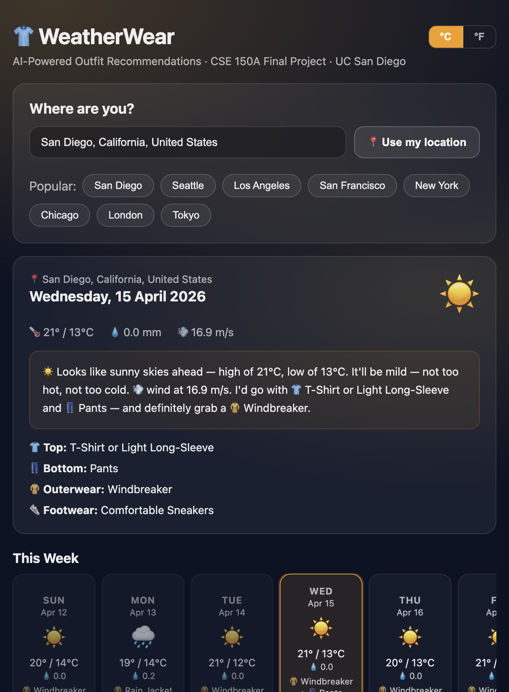

# WeatherWear

**AI-powered outfit recommendations based on real-time weather data.**

Built as the final project for **CSE 150A** (Introduction to Artificial Intelligence: Probabilistic Reasoning and Decision-Making) at **UC San Diego**.

<p align="center">
  
</p>

## What It Does

WeatherWear is a utility-based AI agent that recommends what to wear based on the weather. Select any city in the world and the agent will:

- Fetch real-time and forecasted weather data client-side (via the free [Open-Meteo API](https://open-meteo.com/))
- Classify weather conditions using a **Random Forest model** trained on historical Seattle weather (2012-2015)
- Recommend a full outfit (top, bottom, outerwear, footwear, accessories) with a conversational, emoji-rich explanation
- Show a **weekly view** (Sunday-Saturday) with outfit summaries for each day

The entire system runs without any paid APIs or LLMs.

## Live Demo

**[weatherwear-kpgz.onrender.com](https://weatherwear-kpgz.onrender.com)** (free tier — first load may take ~30s to wake up)

## Features

- **City search** with smart country detection (type "Japan" and get Tokyo, Osaka, Kyoto, etc.)
- **Geolocation** support ("Use my location")
- **Native language names** for non-Latin cities (Tokyo → 東京, Cairo → القاهرة, Munich → München)
- **Clickable weekly forecast** — click any day to see the full breakdown
- **Past vs. future tense** — past days use retrospective language, future days use forecast language
- **Dynamic weather themes** — background changes based on predicted conditions (sun, rain, snow, etc.)
- **Celsius / Fahrenheit toggle**
- **Methodology section** explaining the full decision pipeline on the page itself

## How It Works

```
Browser (client-side)                    Server (FastAPI)
─────────────────────                    ────────────────
         │
         ▼
┌─────────────────────┐
│  Open-Meteo API     │  fetched directly from the browser
│  (weather forecast) │  (avoids server-side rate limits)
└─────────┬───────────┘
          │
          ▼
┌─────────────────────┐       POST /api/recommend
│  4 Features per Day │  ──────────────────────────▶  ┌─────────────────────┐
│  precip, temp, wind │                               │  Random Forest      │
└─────────────────────┘                               │  Classifier         │
                                                      │  (400 trees)        │
                                                      └─────────┬───────────┘
                                                                │
                                                                ▼
                                                      ┌─────────────────────┐
                                                      │  Outfit Policy      │
                                                      │  (rule-based)       │
                                                      └─────────┬───────────┘
                                                                │
                                                      ◀─────────┘
                                                JSON response:
                                                label, outfit, explanation
```

### Model Performance

| Weather | Precision | Recall | F1   |
|---------|-----------|--------|------|
| Rain    | 0.97      | 0.91   | 0.94 |
| Fog     | 0.87      | 0.96   | 0.91 |
| Snow    | 0.89      | 0.89   | 0.89 |
| Drizzle | 0.82      | 0.91   | 0.86 |
| Sun     | 0.76      | 0.92   | 0.83 |

## PEAS Analysis

| Component       | Description |
|-----------------|-------------|
| **Performance** | Accuracy of weather classification and appropriateness of outfit recommendations |
| **Environment** | Real-world weather for any city (Open-Meteo API) + historical Seattle data for training |
| **Actuators**   | Outfit recommendations (top, bottom, outerwear, footwear, accessories) with natural-language explanations |
| **Sensors**     | Precipitation (mm), temp max/min (°C), wind speed (m/s) from Open-Meteo forecasts (fetched client-side) or manual CLI input |

## Tech Stack

- **Backend**: Python, FastAPI, scikit-learn, Jinja2
- **Frontend**: HTML, CSS, vanilla JavaScript (calls Open-Meteo directly from the browser)
- **ML Model**: Random Forest (scikit-learn) trained on [Seattle Weather dataset](https://www.kaggle.com/datasets/ananthr1/weather-prediction/data)
- **APIs**: [Open-Meteo](https://open-meteo.com/) (weather + geocoding), [Nominatim](https://nominatim.openstreetmap.org/) (reverse geocoding)
- **Hosting**: [Render](https://render.com/) (free tier)

## Run Locally

```bash
# Clone and set up
git clone https://github.com/joshleh/WeatherWear.git
cd WeatherWear
python -m venv .venv
source .venv/bin/activate
pip install -r requirements.txt
pip install -e .

# Start the web app
uvicorn weatherwear.webapp:app --reload --port 8010
```

Then open **http://localhost:8010**.

### CLI (offline, no network needed)

```bash
# Train the model
weatherwear train --data seattle-weather.csv

# Demo from a date in the dataset
weatherwear demo date --date 2012-01-01

# Demo with manual weather inputs
weatherwear demo manual --precipitation 3.2 --temp-max 11 --temp-min 5 --wind 6.5
```

## Project Structure

```
src/weatherwear/
    agent.py             Sense → Think → Act orchestration
    model.py             Random Forest training, persistence, inference
    outfit.py            Rule-based outfit policy
    explain.py           Template-based explanation engine (no LLM)
    weather.py           City search + reverse geocoding (Open-Meteo / Nominatim)
    webapp.py            FastAPI web application (serves UI + /api/recommend)
    cli.py               Command-line interface (offline demos)
    types.py             Shared data types
    country_cities.json  Pre-computed city data for 50+ countries

web/
    templates/           HTML + client-side JS (fetches weather directly from Open-Meteo)
    static/              CSS styles

seattle-weather.csv      Training dataset (Seattle 2012-2015)
render.yaml              Render deployment blueprint
```

## Limitations

- The model is trained on Seattle weather (2012-2015). Cities with extreme climates may get unusual classifications, though the outfit policy still uses raw feature values as a fallback.
- The explanation engine is template-based and deterministic — not LLM-generated. This keeps the project 100% free with no API keys.
- Open-Meteo provides up to 7 days of forecast data; accuracy naturally decreases further out.

## License

This project was created for educational purposes as part of CSE 150A at UC San Diego.

## Acknowledgments

- **Dataset**: [Seattle Weather (Kaggle)](https://www.kaggle.com/datasets/ananthr1/weather-prediction/data)
- **Weather API**: [Open-Meteo](https://open-meteo.com/) — free, no API key required
- **Geocoding**: [Nominatim / OpenStreetMap](https://nominatim.openstreetmap.org/) — free, open-source
